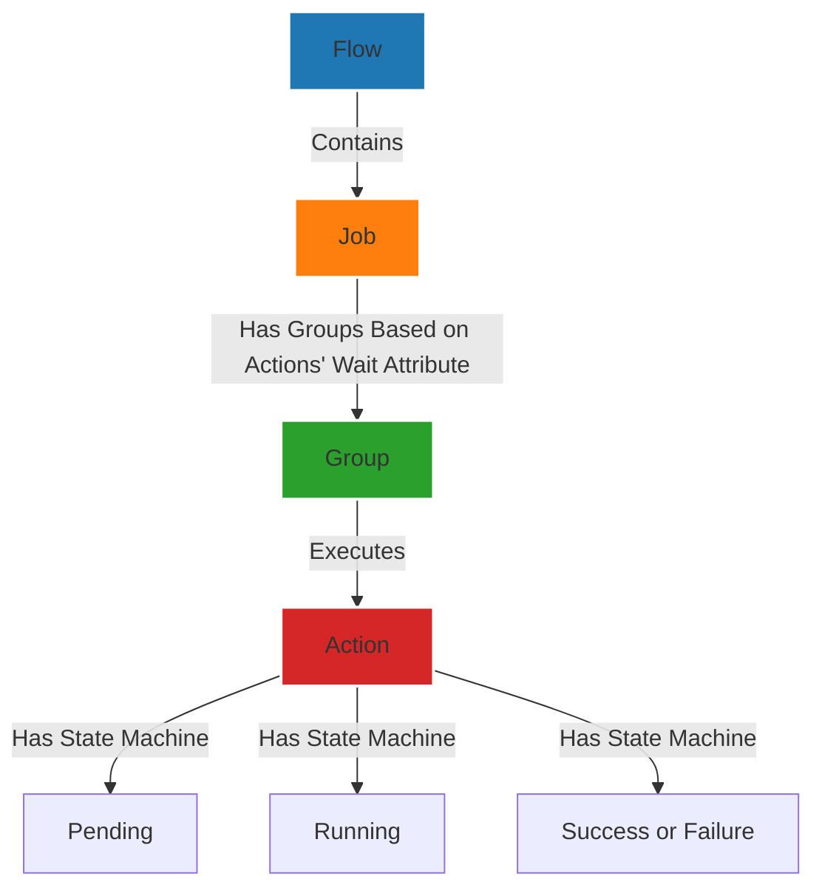

# ActionFlow

The diagram below shows the relationship between the core concepts of ActionFlow: Flow, Job, Group, and Actions.

## Explanation

1. **Flow**: The top-level entity that orchestrates the entire workflow. It contains multiple **Jobs**.
2. **Job**: Represents a collection of actions that execute sequentially. Each job is divided into **Groups**.
3. **Group**: Actions within a job are grouped based on their `wait` attribute. Actions in the same group can run in parallel.
4. **Action**: The smallest executable unit, which follows a predefined state machine (`Pending`, `Running`, `Success`, `Failure`).

### State Management in Actions

Each **Action** is governed by a state machine with the following states:

- **Pending**: Action is queued for execution.
- **Running**: Action is in progress.
- **Success**: Action completed successfully.
- **Failure**: Action failed during execution.